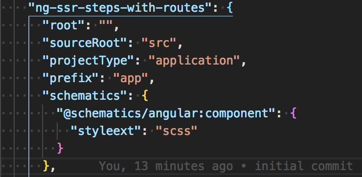

## Create Your project

```
ng new ng-ssr-steps-with-routes
```
	

Answer Y for routing,
and scss for styles

	? Would you like to add Angular routing? Yes
	? Which stylesheet format would you like to use? SCSS   [ http://sass-lang.com   ]
	
	
## Add the ngUniversal library (for express)

```
ng add @nguniversal/express-engine --clientProject [your project name]
```

** Some documentation suggests ng generate, but as of writting the command above scafforlds better:

```
# Example of ng generate ** Do Not Use **
# This does not include the scaffolding and config for express
ng generate universal --client-project [your project name]
```
	

for example:

```
# Example for a project named 'ng-ssr-steps-with-routes'
ng add @nguniversal/express-engine --clientProject ng-ssr-steps-with-routes
```
	
If you are unsure of your project name, or have multiple projects configed, you can find your project name in your angular.config:



## Checking basic ssr


### Checking the scaffolds

If everything scaffolded properly there should be a few new files including:
	
```
.
└── server.ts // The express server
└── webpack.server.config.js // Webpack config for compiling the server from typescript
└── src/
	└── tsconfig.server.json // typescript config for the server
	└── main.server.ts // This is similar to the app/main.ts but points to the server mod
	└──app
		└── app.server.module.ts // Loads

```
 	
 Also the package.json should be updated with scripts to build and compile ssr:
 
```
 	scripts: {
	 	.../
	    "compile:server": "webpack --config webpack.server.config.js --progress --colors",
	    "serve:ssr": "node dist/server",
	    "build:ssr": "npm run build:client-and-server-bundles && npm run compile:server",
	    "build:client-and-server-bundles": "ng build --prod && ng run ng-ssr-steps-with-routes:server:production"
    }
```
 
	
### Running it

To check that this works, run:

1 - Build the server side version

```
npm run build:ssr
```

2 - ...and then serve it:
 	
```
npm run serve:ssr
```

3 - Open the browser to [localhost:4000](http://localhost:4000)

4 - right click and view (page) source

Client side rendered apps will have very little html (in the app-root element):

```
<app-root></app-root>
```
	
	 	
Server side rendered will have much more html (the app-root element will be populated):

```
	<app-root _nghost-sc0="" ng-version="7.0.4"><div _ngcontent-sc0="" style="text-align:center"><h1 _ngcontent-sc0=""> Welcome to ng-ssr-steps-with-routes! </h1></div><h2 _ngcontent-sc0="">Here are some links to help you start: </h2><ul _ngcontent-sc0=""><li _ngcontent-sc0=""><h2 _ngcontent-sc0=""><a _ngcontent-sc0="" href="https://angular.io/tutorial" rel="noopener" target="_blank">Tour of Heroes</a></h2></li><li _ngcontent-sc0=""><h2 _ngcontent-sc0=""><a _ngcontent-sc0="" href="https://github.com/angular/angular-cli/wiki" rel="noopener" target="_blank">CLI Documentation</a></h2></li><li _ngcontent-sc0=""><h2 _ngcontent-sc0=""><a _ngcontent-sc0="" href="https://blog.angular.io/" rel="noopener" target="_blank">Angular blog</a></h2></li></ul><router-outlet _ngcontent-sc0=""></router-outlet></app-root>
```

## Static Rendering

Static rendering involves rendering each route into an html file.

To do this several files will need to be created or modified:

1. The files `./prerender.ts` and `./static.paths.ts` will need to be created.
2. The prerenderer step will need to be added to the `./webpack.server.config.js`.
3. A static site server will need to be created (this is just to test the result). `./static.server.js`.
4. The npm run scripts for prerendering will need to be added to the `./package.json`.


1 - Create the file prerender.ts in the root of your application
	
	
	** You can copy an past the code below into the terminal to create the file and write contents. Otherwise just create 'prerender.ts' and copy the javascript (between the EOF declarations) into the file.
	
```
touch prerender.ts
cat > prerender.ts <<EOF
// Load zone.js for the server.
import 'zone.js/dist/zone-node';
import 'reflect-metadata';
import {readFileSync, writeFileSync, existsSync, mkdirSync} from 'fs';
import {join} from 'path';
	
import {enableProdMode} from '@angular/core';
// Faster server renders w/ Prod mode (dev mode never needed)
enableProdMode();
	
// Import module map for lazy loading
import {provideModuleMap} from '@nguniversal/module-map-ngfactory-loader';
import {renderModuleFactory} from '@angular/platform-server';
import {ROUTES} from './static.paths';
	
// * NOTE :: leave this as require() since this file is built Dynamically from webpack
// * Here the file that is 'required' should be the SSR/static main.js
const {AppServerModuleNgFactory, LAZY_MODULE_MAP} = require('./dist/server/main');
	
const BROWSER_FOLDER = join(process.cwd(), 'browser');
	
// Load the index.html file containing referances to your application bundle.
const index = readFileSync(join('browser', 'index.html'), 'utf8');
	
let previousRender = Promise.resolve();
	
// Iterate each route path
ROUTES.forEach(route => {
  const fullPath = join(BROWSER_FOLDER, route);
	
  // Make sure the directory structure is there
  if (!existsSync(fullPath)) {
    mkdirSync(fullPath);
  }
	
  // Writes rendered HTML to index.html, replacing the file if it already exists.
  previousRender = previousRender.then(_ => renderModuleFactory(AppServerModuleNgFactory, {
    document: index,
    url: route,
    extraProviders: [
      provideModuleMap(LAZY_MODULE_MAP)
    ]
  })).then(html => writeFileSync(join(fullPath, 'index.html'), html));
});
EOF
```


2 - Create the file static.paths.ts in the root of your application

	** again you can copy the code below into your terminal to generate the file and contents.
	
```
touch static.paths.ts
cat > static.paths.ts <<EOF
export const ROUTES = [
  '/',
  '/lazy',// Each one of these should match a route in the app that should be rendered
  '/lazy/nested'
];
EOF
```

3 - Add the prerender to `webpack.server.config.js`

```
module.exports = {
  mode: 'none',
  entry: {
    server: './server.ts',
    prerender: './prerender.ts'
  },
```
4 - Create a simple static file server

```
# install express
npm install express --save-dev
```

```
# Create static.server.js
touch static.server.js
cat > static.server.js <<EOF
const express = require('express');

const app = express();

// Add config directories here... 
app.use(express.static('dist/browser'));

app.listen(3000, () => console.log('Example app listening on port 3000!'))

EOF
```


5 - Add prerender scripts to the package.json

In order to locally serve the static content, it needs to be built, and then served.

```
"scripts": {
...
	"build:prerender": "npm run build:client-and-server-bundles && npm run compile:server && npm run generate:prerender",
	"generate:prerender": "cd dist && node prerender",
	"serve:prerender": "node static.server.js"
}
```

